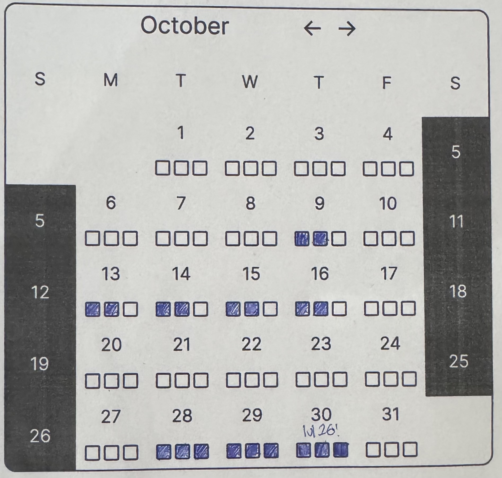

# Simple calendar for my Japanese Learning

This is a simple backendless react page which holds a github actions-coded calendar which will replace / improve upon what I do physically on paper.

At the moment, I write down on a piece of paper what I've done for the day so I can remember - but I think a digital version that I can look at online will be more epic >:&#41;

## ToDo

[x] figure out how to work the [react-calendar-heatmap](https://github.com/kevinsqi/react-calendar-heatmap)
[ ] simple bash script to automate updating the json file
[ ] add extra data (what i've done for the day) on click
[ ] more meaningful information on hover
[ ] figure out this readme situation
[ ] bugfix the tooltip on empty days
